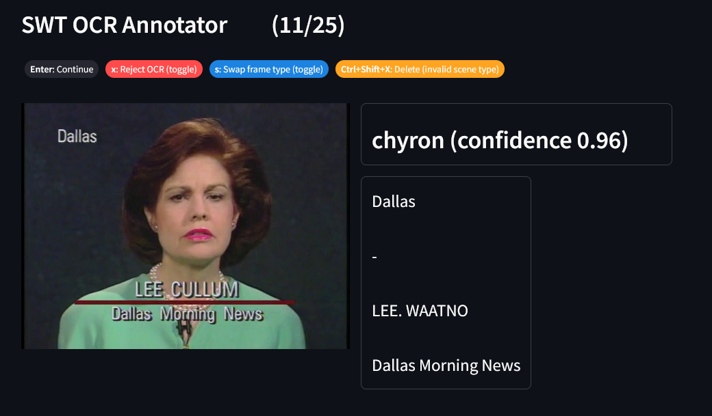
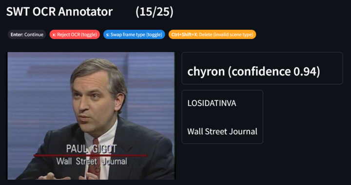

# SWT + OCR Annotation Environment

This is the annotation environment for SWT+OCR results to be passed into LLM for synthetic RFB data. The purpose of this repository is to filter/quality control this data for better downstream results.

## Requirements

Before running the annotation server, make sure to install all requirements using `pip install -r requirements.txt`

## Streamlit server

To fire up the annotation environment, make sure you are first connected to a lab machine and using a VPN such as [Tailscale](https://tailscale.com/). Then, run:

```
streamlit run app.py
```

If all goes well, it will output the Network URL, which you can use to connect to the server. To start annotating, just upload the csv annotation file from your local machine. Annotations will be saved automatically with each change, and you can leave and come back to continue annotating (to resume annotation, just upload the same csv file, even if it isn't updated). All changes are saved to the server.

The annotations can be performed by either using the keystrokes specified at the top, or by pressing the corresponding button under the image. The keystrokes can be changed in the sidebar, which also contains an undo option to revert the most recent annotation.

## Guidelines

- Reject OCR
    - This option should be chosen if the OCR results are unintelligable. Benign mispellings are okay, and should not be rejected unless it is impossible to infer the original meaning from the text.
    -  ✔️ This is okay and should not be rejected
    -   ❌ This is unintelligable and should be rejected
- Swap Frame Type
    - This option should be chosen if the frame type is wrong (only for credits and chyrons)
- Remove
    - This option should be chosen if the true frame type is neither a credit nor chyron